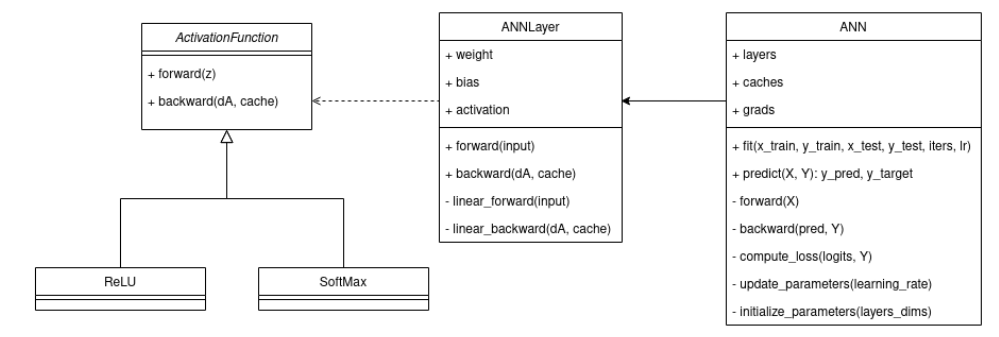
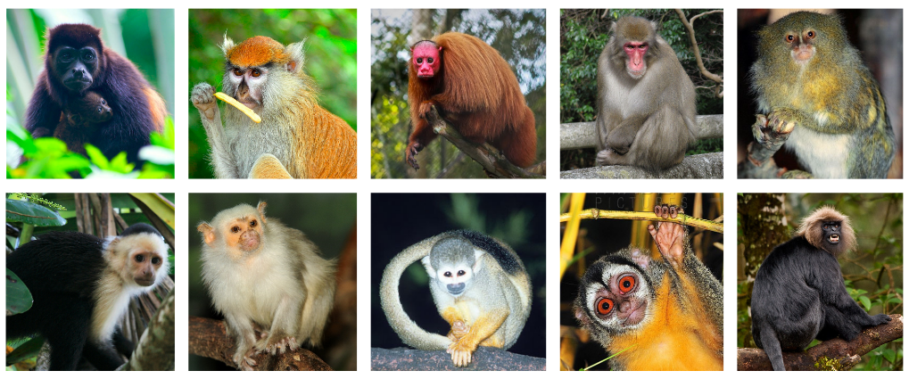
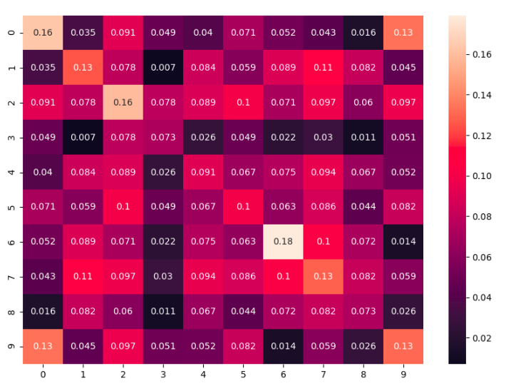

# ANN
Implementation from scratch of an artificial neural network. As a proof of concept, a model was further created for the "10 Monkey Species" classification problem, along with an analysis of results. 

## ANN Module - Design Description
**Learning type**: Supervised learning  
**Task**: To classify 10 monkey species from images  
**Performance measure**: Percentage of correctly classified images  
**Training experience**: The “10 Monkey Species" dataset  
**Target function**: F: Image -> Per-class-probability  
**Target function** representation: ANN  
**Learning algorithm**: Gradient descent

The figure below depicts the class diagram of the ANN implementation. We have the following
classes:
* **ActivationFunction**: abstract class to be inherited by different activation functions. In our
case, as we perform multi-class classification, the activation of the last layer is Softmax.
For the other layers we will use ReLU.
* **ReLU**: class that implements the forward and backward functions for the ReLU
activation
* **SoftMax**: class that implements the forward and backward functions for the SoftMax
activation
* **ANNLayer**: holds the parameters (weights and bias) of each layer, along with the
activation
* **ANN**: contains the fit and predict functions that will be used when training and testing a
network. It does also implement functions for parameters initialization and update, cost
computation and forward/backward pass through the entire network.

Besides the ANN module, helper scripts are required for:
* Metrics: computation of various metrics (accuracy, precision, recall, F-score, confidence
intervals)
* Plots: displaying loss plots, confusion matrices, metrics overviews

## Problem Analysis
The goal of the current project is to implement from scratch an Artificial Neural Network that
can be used for multi-class image classification. The chosen type of ANNs is Feed Forward
Network. The data that will be classified is the “10 Monkey Species" dataset, consisting of
images of 10 different monkey species.

### Data
The dataset images are part of 10 different classes, with a total of 1370 images. Below, we can
observe an image from each class. The displayed images allow distinctive features of each
species to be easily retrieved, but the dataset contains some challenging images that make the
task difficult.

The table below illustrates the number of images per class. We notice that the dataset is balanced.
| Class 0 | Class 1| Class 2 | C;ass 3 | Class 4 | Class 5 | Class 6 | Class 7 | Class 8 | Class 9|
| --- | --- | --- | --- | --- | --- | --- | --- | --- | --- |
| 131 | 139 | 137 | 152 | 131 | 141 | 132 | 142 | 133 | 132 |

An analysis of the features used in learning was also performed. As we talk about images, the
features are pixel values. We computed the correlation between all the images in class i and all
the images in class j, where i = [1, 10], j = [1, 10]. To obtain a single value for the correlation, we
average the correlation between all pairs of images. The resulting correlation matrix is
displayed below:

For in-class correlations, we notice higher correlations for classes 0, 1, 2, 6, 7 and 9. On the
other side, for classes 3 and 8 the correlation has 2-3 times smaller values.
We notice that some of the inter-class correlations are in the same range as in-class
correlations. Such strong correlations between distinct classes might have a negative impact on
performance. These strong correlations apply for the following pairs (order matters – the first
element in the tuple is the problematic one, with inter-class correlations close to in-class
correlation):
(0, 9), (1, 7), (4, 1), (4, 2), (4, 6), (4, 7), (5, 2), (5, 7), (7, 1), (8, 1), (8, 4), (8, 6), (8, 7), (9, 1)
None of the correlations is very strong in absolute value (i.e., close to 1 or –1). However, by
comparing correlation values to each other, we notice that some classes might have similar
distributions to each other. Also, some of the classes have reduced in-class variation, hence
stronger in-class correlation.

## Experimental results
The current project aims to classify images from the “10 Monkey Species” dataset, in 10
classes corresponding to their species. Consequently, the task is a multi-class image
classification problem. The problem is solved using an Artificial Neural Network, more
precisely a Deep Feed Forward Network.
Performed experiments include the variation of number of layers, layers sizes and learning rate.
For each experiment, a k-fold cross-validation was used.
Activation functions, regardless of the number or size or layers, are set according to:
* Last layer: SoftMax activation; given that we perform multi-class classification, the last
layer should output probabilities for each class, where the sum of the probabilities is
always 1.
* Other layers: ReLU activation
To evaluate performance, accuracy is the central metric, but it is associated with confusion
matrices, precision, recall and f-score for a better understanding of the results. Furthermore, to
have a statistical analysis of the accuracy measurements across the cross-validation iterations, we
compute 95% confidence interval.

